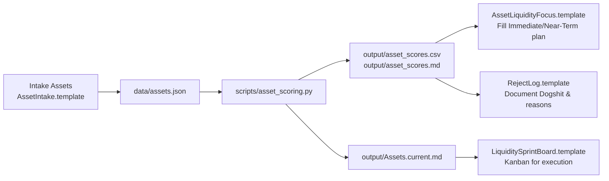

# XRPL-Template-system

[](https://github.com/kevanbtc/XRPL-Template-system/actions/workflows/ci.yml)


Institutional‑grade liquidity scoring, policy‑driven AI swarm (dry‑run), and security docs for operating as a sovereign rails operator on XRPL.

---

## Contents

- [Highlights](#highlights)
- [Quick Start](#quick-start)
- [System Architecture](#system-architecture)
- [Policy-Driven AI](#policy-driven-ai)
- [Forensic Audit Trail](#forensic-audit-trail)
- [Weekly Cadence](#weekly-cadence)
- [Repository Structure](#repository-structure)
- [Roadmap](#roadmap)
- [Contributing](#contributing)
- [Security & Compliance](#security--compliance)

---

## Highlights

- Scoring engine with gates and hard rejects (TTC/LTV/LD/CC/VF)
- Grouped index page for prioritization (Immediate/Near‑Term first)
- AI swarm that reads scores, applies policy, simulates markets, and produces a dry‑run plan
- Externalized policy in YAML for auditability and change control
- Forensic JSON run logs for each AI run

---

## Quick Start

Outputs will appear in `output/`, AI logs in `output/ai_runs/`.

Windows PowerShell:

```powershell
python .\ai\run.py
```

macOS/Linux:

```bash
python ./ai/run.py
```

This runs the policy‑driven swarm in dry‑run mode and writes a structured JSON run log to `output/ai_runs/`.

---

## System Architecture

This repo is a playbook + engine for turning a messy pile of real-world assets (RWA) into a ranked, disciplined liquidity plan.

It does three core things:

1. Score assets (mines, notes, IP, claims, collectibles, etc.) for:
   - Time-to-cash (TTC)
   - Loan-to-value potential (LTV)
   - Liquidity depth (LD)
   - Compliance/cleanliness (CC)
   - Verification / proof quality (VF)
2. Bucket them into:
   - Immediate, Near-Term, Background, Archive, Reject / Dogshit
3. Drive execution using:
   - Intake forms
   - Focus templates
   - A sprint board
   - A reject log so you don’t keep re-believing fairy tales

---

## Repository Structure

```text
XRPL-Template-system/
  README.md                    # This file – overview + diagrams
  scripts/
    asset_scoring.py           # Scoring engine (TTC/LTV/LD/CC/VF + gates)
    generate_assets_index.py   # Builds grouped Assets.current.md from CSV
  data/
    assets.json                # Source assets and raw inputs
  docs/
    scoring/
      README.md                # Ops manual: how to run and use the system
      Assets.current.md        # Latest ranked asset index (generated)
    templates/
      scoring/
        AssetIntake.template.md         # Intake sheet per asset
        AssetLiquidityFocus.template.md # 7–14 day focus plan
        LiquiditySprintBoard.template.md# Kanban-style sprint view
        RejectLog.template.md           # Hard “Dogshit” log with rules
  output/
    asset_scores.csv           # Ranked scores for BI / dashboards
    asset_scores.md            # Human-readable breakdown + reasons
    Assets.current.md          # Generated from the last scoring run
```

---

## Scoring Model (High‑Level)

Each asset is evaluated on 5 dimensions (0–5):

- TTC – Time-to-Cash
- LTV – Loan-to-Value potential
- LD – Liquidity Depth
- CC – Compliance / Cleanliness
- VF – Verification / Proof quality

The engine:

- Applies weights (see docs/scoring/README.md)
- Applies gates & penalties (e.g., low CC/VF caps your bucket)
- Enforces hard Reject (“Dogshit”) rules, for example:
  - TTC == 0
  - VF <= 1
  - CC <= 1
  - Or LD <= 1 AND LTV <= 1

Buckets:

- Immediate – do this now, allocate ~40% bandwidth
- Near-Term – unlock 1–3 things to promote to Immediate
- Background – cheap doc/proof work while you execute on the top
- Archive – real but not worth active cycles right now
- Reject / Dogshit – no more time until real evidence appears

---

## System Flow



---

## Policy-Driven AI

- Policy file: `ai/config/ai_policy.yaml`
- Changing these values is a policy change (requires review/approval)
- Risk gates enforced: allowed buckets, minimum score, minimum net bps, max trades, position and portfolio caps

## Forensic Audit Trail

- Every run emits `output/ai_runs/ai_run_YYYYMMDDTHHMMSSZ.json`
- Includes: timestamp, policy snapshot, inputs (scores + focus set), agent messages, approved opps, and the dry‑run trade plan

## Weekly Cadence

1) Add / update assets

- Edit `data/assets.json` (or use `AssetIntake.template.md` to standardize inputs, then convert to JSON).

1) Runbook in 3 commands

```bash
# 1) Score assets (adjust flags if your script differs)
python scripts/asset_scoring.py \
  --weights docs/templates/scoring/AssetScoringWeights.jsonc \
  --assets  data/assets.json \
  --csv     output/asset_scores.csv \
  --md      output/asset_scores.md

# 2) Generate grouped index (bucketed)
python scripts/generate_assets_index.py \
  --input  output/asset_scores.csv \
  --output output/Assets.current.md

# 3) Open ops manual & focus template
# docs/scoring/README.md
# docs/templates/scoring/AssetLiquidityFocus.template.md
```

1) Generate the assets index page (optional)

- Build `output/Assets.current.md` grouped by bucket from the CSV.

1) Plan your sprint

- Use the focus template for Immediate/Near-Term.
- Track execution with the sprint board.
- Log hard rejects with the reject log.

## Layout

- `data/` – source assets list (JSON, CSV)
- `scripts/` – scoring engine + index generation
- `output/` – generated scores and reports
- `docs/scoring/` – ops manual + current snapshot template
- `docs/templates/scoring/` – Intake, Focus, Sprint, Reject templates

## Roadmap

- [ ] Snapshot helper to archive CSV and AI logs into `history/`
- [ ] Exchange adapters: XRPL DEX, CEX, and OTC stubs (dry‑run)
- [ ] Unit tests for policy mapping, gating, and planner safety belts
- [ ] CI: lint + unit tests; coverage badge

## Contributing

Issues and PRs are welcome. See `CONTRIBUTING.md`.

## Security & Compliance

- Internal: to focus engineering, legal, and BD on assets that turn into cash the fastest.
- Lenders / Partners: to see why specific assets are prioritized, with clear gates and reject criteria.
- Auditors / Compliance: to verify that liquidity decisions follow a documented, repeatable process.

For day‑to‑day operations, see `docs/scoring/README.md`. This repository is policy‑driven and dry‑run by default; all real execution remains gated by human approval and on‑ledger checks.
